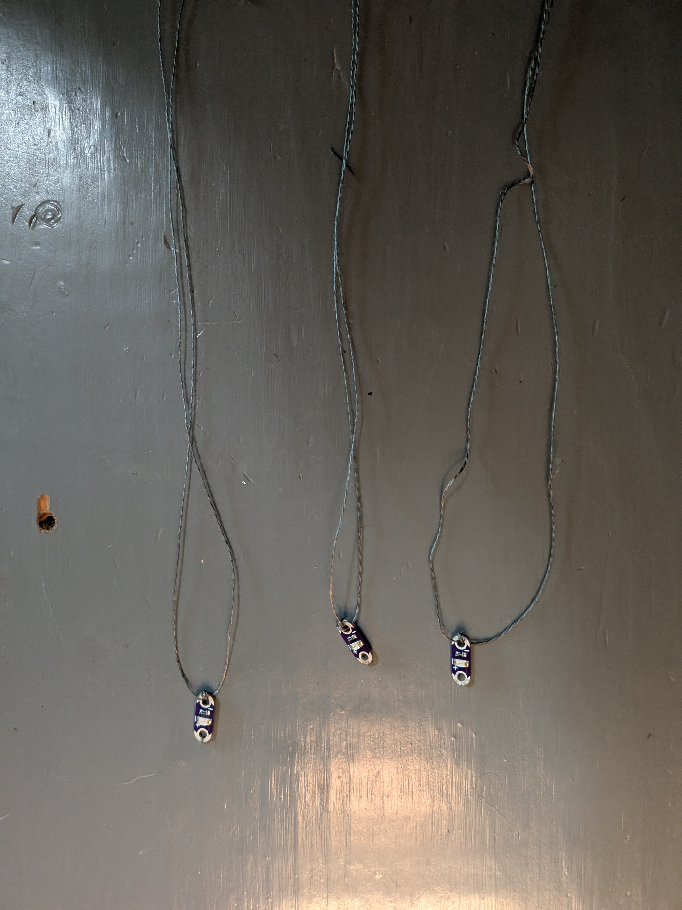
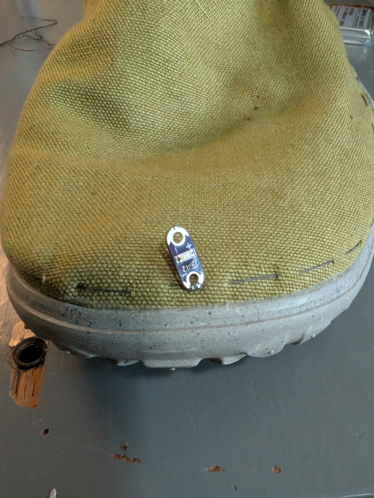
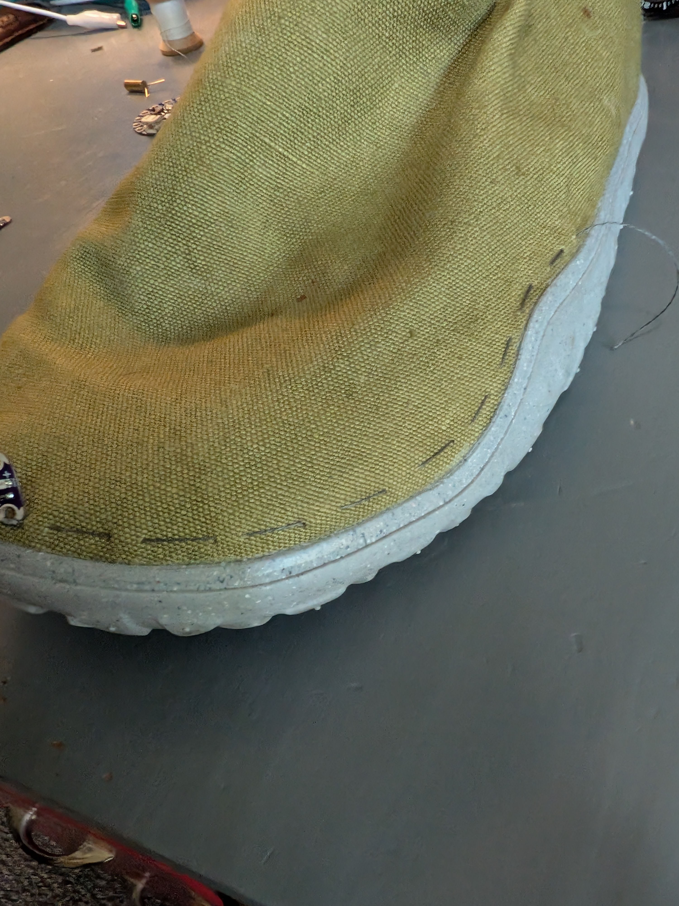

# Flora Blink Shoe

A wearable shoe that responds to movement with accelerating LED blinks!

---

## Table of Contents

- [Overview](#overview)
- [Parts List](#parts-list)
- [Code Walkthrough](#code-walkthrough)
- [Let's Get Sewing](#lets-get-sewing)
- [Troubleshooting](#troubleshooting)
- [Calibrating](#calibrating)
- [Done!](#done)

---

## Overview

This guide will walk you through how to create a motion activated light up shoe that is useful for:
- Nighttime visibility
- Practicing your sewing skills
- Recreating the cool shoes you had as a kid!

I created this shoe with the intention of modifying my running shoes to make me easier to see at night. The more frequently the wearer moves, the faster the LEDs blink. This guide should be usable for most shoes, but in this case I am working with a pair of Nike shoes covered in a consistent fabric material across most of the shoe.

---

## Parts List

- 1x [Adafruit flora](https://www.adafruit.com/product/659)
- The following from the [Lilypad Protosnap Plus](https://www.sparkfun.com/lilypad-protosnap-plus.html):
  - 3x LED (any color works!)
  - 1x Switch
- 1x [tilt sensor](https://www.sparkfun.com/tilt-sensor-at407.html?gQT=1)
- 1x [LiPo battery](https://www.amazon.com/EEMB-Rechargeable-Connector-Wireless-Polarity/dp/B0B7N2T1TD)
- 1x Shoe (any)
- 1x Spool of thread (any)
- 1x Ordinary needle (any)
- 1x [Leather needle](https://www.amazon.com/dp/B08H86BQJB)


---

## Code Walkthrough

The code required for this project is relatively simple! For in-depth information see the [full code](blink_shoe.ino). I will explain the helper functions here.

### handleMovement
```
void handleMovement() {
  unsigned long currentTime = millis();

  // Only increase activity level on the "active" tilt state
  if (currentTiltState == ACTIVE_STATE) {
    if (ledFlashing) {
      // Already flashing - increase activity level
      if (activityLevel < maxActivityLevel) {
        activityLevel++;
      }
      // Reset the waiting period
      waitingToStop = false;
    } else {
      // Start flashing
      ledFlashing = true;
      lastFlashTime = currentTime;
      ledState = HIGH;
      digitalWrite(LED_PIN_10, ledState);
      digitalWrite(LED_PIN_12, ledState);
      activityLevel++;
      Serial.println("Started");
    }

    updateFlashRate();
    lastActivityTime = currentTime;
  }
}
```
This function determines if the wearer is moving, and makes the decision to up the "activity level". The activiy level is what determines how fast the shoe should be blinking. It starts by grabbing the current time (something that this program does a lot!) using the `millis()` function. This function gets the time in milliseconds since the Flora started up. This gets used frequently to determine the time since something has happened! It is also why many of the global variables used are unsigned longs, which are meant to be compared to values returned by `millis()`.

After getting the time, the current tilted state is checked. The tilt sensor I used for this project has two states, tilted and untilted. Since I am not exactly measuring how tilted the shoe is, but whether it is moving, I only care about one of the two possible states and whether or not that state has changed and then returned back.

If the LEDs are already flashing then the activity level is increased, this means the wearer is in motion and has remained in motion! Otherwise the wearer has just started moving, the LEDs must begin to flash and the activity level is incremented.

The flash speed is then adjusted and the time is recorded. This time is used to decrement the activity level once the wearer stops moving.

### updateFlashRate
```
void updateFlashRate() {
  if (activityLevel == 0) {
    currentFlashInterval = baseInterval;
  } else {
    // Calculate blink rate linearly
    float minHz = 1000.0 / baseInterval;
    float maxHz = 1000.0 / fastestInterval;
    float hzStep = (maxHz - minHz) / maxActivityLevel;

    float targetHz = minHz + (hzStep * activityLevel);
    currentFlashInterval = (unsigned long)(1000.0 / targetHz);
  }
}
```
This is the other important helper function! This function is responsible for calculating and updating the rate at which the LEDs blink. The math behind the calculation works by finding the max and min Hz relative to the slowest and fastest time intervals, then finding a linear step size. This step size is then multiplied by the activity level!

---

## Let's Get Sewing

### Getting started:
I am going to have three LEDs. One on the front, outer side, and rear of the shoe. I'll begin by attaching conductive thread to the negative connectors of each LED:

Make sure that you loop through at least a few times before tying off and to use more thread than you think you'll need! The last thing we want is a loose connection somewhere that will be hard to [troubleshoot](#troubleshooting).
- From here on out I will not go in-depth on connecting conductive thread to connectors on sensors and actuators. The method that I use goes as follows:
  - Loop through the connector once.
  - Tie two safety knots (simple over under half knots).
  - Loop through 3-5 additional times, ensuring that the loops are tight.

### Attaching LEDs
Now that the LEDs have their negative connectors wired up, let's get them attached to the shoe! The wiring setup this project uses involves a ground (negative) circuit that goes around the base of the shoe. This ensures that things stay simple as the LEDs will share the same ground.

Here we have our first LED, the front LED, sewn onto the shoe. We are going about this one LED at a time and then tying them together to connect the ground circuit to ensure that each LED is placed exactly where we want it!

Go at least halfway in each direction to where you want to put the next LED, that way the wires can meet in the middle and be tied together.

Here is the other end! I'll go into less detail about the other two LEDs as the same process is reapeated!


Here we have the second and third LEDs sewn in! Do not worry about the positive connections yet, we do not want to get started on those until the Flora is installed!

---

## Troubleshooting

[Common issues and how to fix them]

---

## Calibrating

[How to adjust settings and test the system]

---

## Done!

[Final thoughts, usage tips, and next steps]